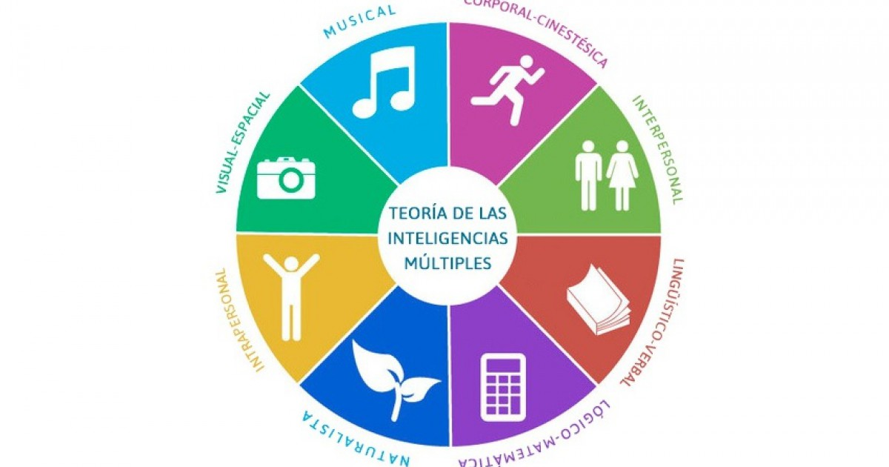

# INTELIGENCIAS MULTIPLES

la inteligencia lógica. Algunos test de inteligencia más completos estudian la capacidad verbal, la capacidad manipulativa y la velocidad de procesamiento.

Pero según Howard Gardner existen otras muchas inteligencias que nos diferencian a los seres humanos y que no se miden en los test de inteligencia habituales.

## las Inteligencias Múltiples

Según la **Teoría de las inteligencias múltiples** de **Howard Gardner** podemos distinguir tipos diferentes de inteligencia formal:

– **Inteligencia lógico-matemática** : la habilidad que poseemos para resolver problemas tanto lógicos como matemáticos. Comprende las capacidades que necesitamos para manejar operaciones matemáticas y razonar correctamente. Es la más semejante a la inteligencia que miden los test de inteligencia normales.

– **Inteligencia lingüística-verbal** : la fluidez que posee una persona en el uso de la palabra. Destreza en la utilización del lenguaje, haciendo hincapié en el significado de las palabras, su orden sintáctico Y sus sonidos.

– **Inteligencia visual-espacial** : Es la habilidad de crear un modelo mental de formas, colores y texturas. Está ligada a la imaginación. Una persona con alta inteligencia visual está capacitada para transformar lo que crea en su mente en imágenes, tal como se expresa en el arte gráfico. Esta inteligencia nos capacita para crear diseños, cuadros, diagramas y construir cosas.

– **Inteligencia corporal- cinestésica o corporal-kinestésica** : Es la habilidad para controlar los movimientos de todo el cuerpo para realizar actividades físicas. Se usa para efectuar actividades como deportes, que requieren coordinación y un ritmo controlado, ballet, etc.

– **Inteligencia musical** : Es la habilidad que nos permite crear sonidos, ritmos y melodías. Nos sirve para crear sonidos nuevos para expresar emociones y sentimientos a través de la música.

– **Inteligencia interpersonal** : Consiste en relacionarse y comprender a otras personas. Incluye las habilidades para mostrar expresiones faciales, controlar la voz y expresar gestos en determinadas ocasiones. También abarca la capacidad para percibir las emociones en otras personas.

– **Inteligencia intrapersonal** : Es nuestra capacidad de relacionarnos con nosotros mismos, entender lo que hacemos y valorar nuestras propias acciones.

– **Inteligencia naturalista** : Consiste en el entendimiento del entorno natural y la observación científica de la naturaleza como la biología, geología o astronomía. Lo importante en la vida es saber en qué somos buenos, cuáles son nuestras fortalezas para desarrollarlas y aprovecharlas al máximo.
