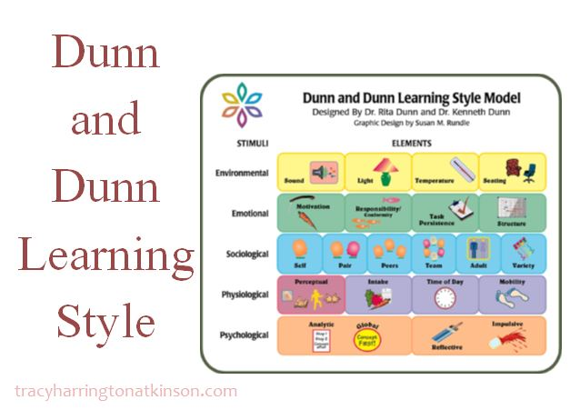

# Modelo Dunn y Dunn.

## Los elementos de los estilos de aprendizaje.

Dunn y Dunn (1975) describen el estilo de aprendizaje como &quot;la manera en la que 18 elementos diferentes, que proceden de 4 estímulos básicos, afectan la habilidad de una persona para absorber y retener información, valores, hechos y conceptos&quot;. (Guild y Garger, 1998, pp. 100).

Dichos elementos eran 18 en un inicio y posteriormente se agregaron 6, haciendo un total de 24. El cuadro presentado a continuación ejemplifica la forma como esos elementos se agrupan.

Para lograr una mejor comprensión de los diferentes elementos, a continuación se brindan algunas explicaciones útiles.

## Elementos ambientales (lugar de estudio):

Estos elementos ayudan a crear un mayor o menor grado de confort que propicia en los estudiantes una disposición al aprendizaje.

## Elementos emocionales

Estos elementos tienen una relación muy estrecha con la edad de los individuos.

## Elementos sociológicos (se hace referencia al número de personas con las que se involucra):

En diferentes situaciones hay alumnos que prefieren trabajar de manera individual o en pequeño o gran grupo. Estos elementos se relacionan con la personalidad de los individuos.

## Elementos físicos:

En el aspecto de las preferencias perceptuales, vale la pena retomar el modelo VARK, ya que explica a profundidad la percepción auditiva, visual y quinésica. Cada vez más se hacen investigaciones que involucran los aspectos fisiológicos como la alimentación, el movimiento, el sueño,etc., en su relación con el aprendizaje.

## Elementos psicológicos:

En relación a estos elementos, se sugiere revisar el modelo 4MAT.

Adicionalmente al modelo Dunn y Dunn, junto con Gary Price, desarrollaron un cuestionario al que llamaron\_ \_Learning Styles Inventory o LSI (Inventario de estilos de aprendizaje). Este cuestionario permite identificar los elementos que determinada persona considera importante para aprender y por lo tanto su estilo de aprendizaje.

`youtube:https://www.youtube.com/watch?v=Ko-Q0bMcnO4&t=2s`
