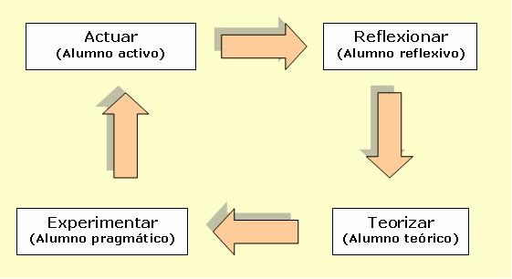

# Aprendizaje basado en el modelo de Kolb

Este artículo aborda el tema de los estilos de aprendizaje que presentan los estudiantes de la Corporación Universitaria Minuto de Dios, con sede en Bogotá, Colombia, en la modalidad de educación virtual. Este estudio se sustenta en el modelo teórico de Kolb (1984) y sigue una metodología de investigación cuantitativa de tipo no experimental, transversal y descriptiva. El análisis se aborda a partir de la aplicación de los instrumentos a los estudiantes del curso de &quot;Liderazgo en valores&quot;, impartido a través de la plataforma Moodle. Los instrumentos aplicados fueron: el inventario de Kolb (1984) a los estudiantes, la encuesta a tutores y la rejilla de análisis de contenido. Entre los resultados del inventario de Kolb, se encontró que el estilo de aprendizaje predominante de los estudiantes es el divergente, caracterizado por su interés hacia el prójimo y capacidad de ver las cosas desde diversas perspectivas (Kolb, 1984b); en contraposición, la rejilla de análisis de contenido cuantitativo utilizada en la plataforma virtual de Moodle demostró que el diseño del curso privilegia el estilo de aprendizaje convergente.

